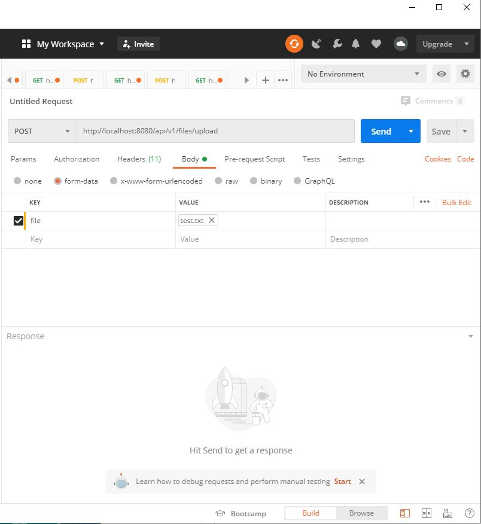
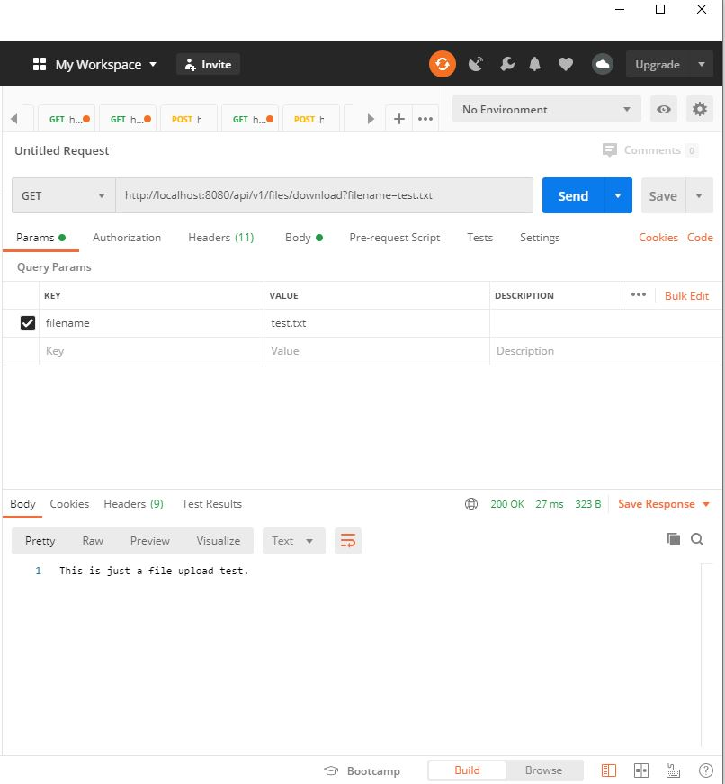
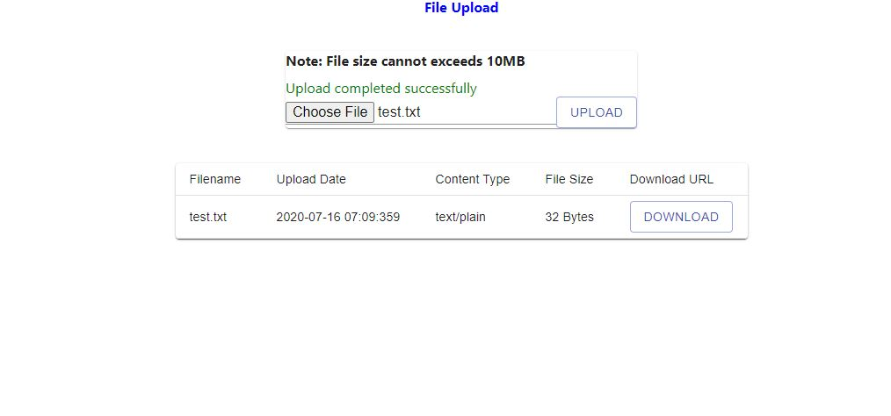

# Getting Started

##### TravisCI build status: [](https://travis-ci.org/jastao/file-up-download-demo)

This is a simple file upload and download application. The frontend interface is written in ReactJS and the backend is 
written using Spring Boot. We will use a H2-database as our file repository for development environment. In production,
the file should be saved somewhere in the local server file system. 

Both the frontend/backend applications are built by Maven with the frontend-maven-plugin.

#### Instructions 

The application is built using Maven. Execute the following maven command to build the executable fat jar. 
```
mvn clean install
```

To run the application, execute the following command
```
java -jar target/file-upload-download-demo.jar
```

### Available Rest Endpoints

Postman can be used to test the backend rest endpoints. 

URL | Method | Description
--- | --- | ---
/api/v1/files/download?filename=filename | GET | Download file in format of txt, jpg, pdf, html, and etc.
/api/v1/files | GET | Get a listing of available files.
/api/v1/files/upload | POST | Uploads files.

#### Testing upload file

Specify the URL request for uploading file in Postman.
```
POST - http://localhost:8080/api/v1/files/upload
```
In the "Body" tab, we will send the file as "form-data" with the key set to "file" and value set to the upload file. 
After submitting the request, a http status of "201 Created" is returned which shows the file is successfully uploaded.



#### Testing download file

Specify the URL request for uploading file in Postman.
```
Get - http://localhost:8080/api/v1/files/download
```
We will send the requested filename as a request param. In the "Params" tab, specify key as "filename" and the value as
the filename. After submitting the request, a http status of "200 OK" is returned which shows the requested file is 
successfully downloaded.



#### File Upload/Downloader

